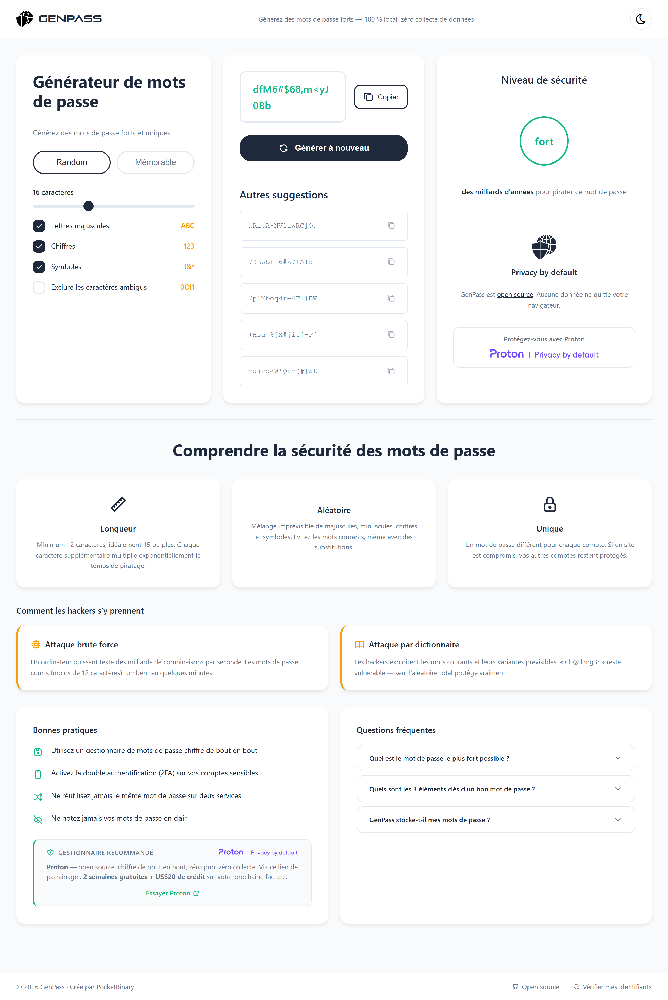

# GenPass

Générateur de mots de passe sécurisé — 100 % local, zéro collecte de données.

🔗 **[genpass.fr](https://genpass.fr/)**




## Fonctionnalités

- **Mode Random** — Mots de passe aléatoires (8–32 caractères) avec contrôle fin : majuscules, chiffres, symboles, exclusion des caractères ambigus
- **Mode Mémorable** — Phrases secrètes à base de mots français (~511 mots), avec chiffres, symboles et séparateurs configurables
- **Mode Citation** — Génération à partir de citations célèbres, transformées en mots-clés tronqués
- **Indicateur de force** — Score de sécurité en temps réel + estimation du temps de craquage (brute force @ 10 milliards essais/s)
- **5 suggestions** — Alternatives générées en un clic pour choisir rapidement
- **Thème clair / sombre** — Bascule instantanée, préférence sauvegardée
- **PWA installable** — Fonctionne 100 % hors ligne grâce au Service Worker
- **Raccourci clavier** — `Entrée` pour régénérer

## Stack technique

| Catégorie   | Technologie                                                                                                       |
| ----------- | ----------------------------------------------------------------------------------------------------------------- |
| Langage     | Vanilla JavaScript (ES6+) — zéro dépendance                                                                       |
| Crypto      | [Web Crypto API](https://developer.mozilla.org/fr/docs/Web/API/Crypto/getRandomValues) (`crypto.getRandomValues`) |
| Icônes      | [Tabler Icons](https://tabler.io/icons) (CSS local, pas de CDN)                                                   |
| Hébergement | GitHub Pages                                                                                                      |
| Sécurité    | CSP strict, protection XSS, pas d'inline scripts                                                                  |

## Utilisation locale

```bash
git clone https://github.com/SletOne/genpass.git
cd genpass
```

Ouvrez `index.html` dans votre navigateur. Aucun build, aucun serveur requis.

## Sécurité & vie privée

- **Aucune donnée ne quitte votre navigateur** — tout est généré localement
- **Aucun tracking, aucun cookie, aucune analytics**
- **Open source** — le code est auditable par tous
- Utilise l'API Web Crypto (CSPRNG) — pas `Math.random()`

## Licence

[MIT](LICENSE) — libre d'utilisation, modification et redistribution.
